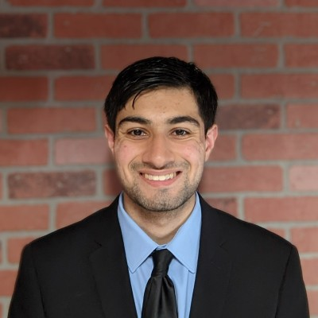

#

  
  
  

    
Sidh Gurnani

    
B.S. Mechanical Engineering · Purdue University · May 2025

  

## **About Me**
Hello! I am a mechanical engineering graduate with a strong passion for learning, problem-solving, and developing innovative solutions. I actively seek opportunities to expand my knowledge and skills while growing both professionally and personally. I’m excited to contribute to meaningful projects and to continuously improve through new challenges.

My experience includes working with various tools and programs that allow me to contribute to projects on all fronts, notably:

* **CAD & FEA:** Siemens NX, Creo Parametric, ANSYS  
* **Programming:** Arduino (C/C++), Python, MATLAB, Simulink, Java, HTML  
* **Other/Misc:** Computer Vision (YOLO), 3D Printing, Manual & CNC Machining, Microsoft Office

I enjoy tackling complex challenges that require a balance of creative thinking and technical precision. I am particularly motivated by opportunities that lead to innovative and practical solutions across a variety of engineering fields. This approach allows me to continuously learn and adapt as I grow in my career.

Outside of engineering, I enjoy exploring new interests and developing skills that broaden my perspective. I’m eager to collaborate with others and contribute to projects that drive meaningful results.

 

## **Education**
_B.S. Mechanical Engineering · Purdue University · Aug 2021 - May 2025_

**Coursework:**

* **Math:** Calculus I-III, Linear Algebra, Differential Equations
* **Controls:** Electrical Engineering Fundamentals I, Controls I, Controls II
* **Mechanics:** Statics, Dynamics, Mechanics of Materials, Machine Design, Structure and Properties of Materials
* **Programming:** Object Oriented Programming (in Java), Entry-Level Programming in Python, The Data Mine Seminar II, The Data Mine Corporate Partners IV
* **Energy:** Thermodynamics I, Fluid Mechanics, Fluid Mechanics Lab, Heat and Mass Transfer
* **Design:** Graphical Communication, Computer Aided Design & Prototyping (Toy Design), Tools, Methods, and Techniques for Rapid, Iterative Product Design and Analysis, Sophomore Design, Capstone Senior Design
* **Other Electives:** Electric Vehicle Design, Engineering Economics, Introduction to Finite Element Analysis, System Methods

**Involvement:**

* **Purdue Formula SAE:** Drivetrain Member &rarr; Drivetrain System Owner (Sept 2022 to May 2025)
* **The Data Mine:** Data Science Undergraduate Reasearcher (Jan 2025 to May 2025)
* **ME 290 Peer Mentor:** (Aug 2024 to May 2025)

 

## **Resume**

<a href="./assets/Sidh Gurnani - Resume (8.04).pdf" target="_blank" class="md-button md-button--primary">
  CLICK TO VIEW MY RESUME
</a>

 

## **Projects**
<a href="projects/" target="_blank" class="md-button md-button--primary">
  CLICK TO VIEW MY PROJECTS
</a>