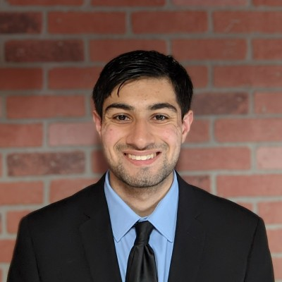

#

  
  
  

    
Sidh Gurnani

    
B.S. Mechanical Engineering · Purdue University · May 2025

  

## **About Me**
Hello! I am a mechanical engineering graduate with a strong passion for learning, problem-solving, and developing innovative solutions. I am a dependable and self-motivated individual who actively seeks opportunities to expand my knowledge and skills while growing both professionally and personally. I’m excited to contribute to meaningful projects and to continuously improve through new challenges.

My experience includes working with various tools and programs that allow me to contribute to projects on all fronts, notably:

* **CAD & FEA:** Siemens NX, Creo Parametric, ANSYS  
* **Programming:** Arduino (C/C++), Python, MATLAB, Simulink, Java, HTML  
* **Other/Misc:** Computer Vision (YOLO), 3D Printing, Manual & CNC Machining, Microsoft Office, MkDocs Documentation

I enjoy tackling complex challenges that require a balance of creative thinking and technical precision. I have experience self-managing projects, coordinating tasks, and documenting work clearly, which allows me to apply a basic level of project management while leveraging AI and machine learning to drive projects forward. This approach enables me to deliver innovative and practical solutions across a variety of engineering fields, continuously learning and adapting as I grow in my career.

In addition, I have also passed the Fundamentals of Engineering Mechanical Exam. View my certificate [here](https://www.credly.com/badges/e26c9eab-09fa-4799-9187-35e7419987a9/linked_in_profile).

Outside of engineering, I enjoy exploring new interests and developing skills that broaden my perspective. I’m eager to collaborate with others and contribute to projects that drive meaningful results.

 

## **Education**
_B.S. Mechanical Engineering · Purdue University · Aug 2021 - May 2025_

**Coursework:**

* **Math:** Calculus I-III; Linear Algebra; Differential Equations
* **Controls:** Electrical Engineering Fundamentals I; Controls I; Controls II
* **Mechanics:** Statics; Dynamics; Mechanics of Materials; Machine Design; Structure and Properties of Materials
* **Programming:** Object Oriented Programming (in Java); Entry-Level Programming in Python; The Data Mine Seminar II; The Data Mine Corporate Partners IV
* **Energy:** Thermodynamics I; Fluid Mechanics; Fluid Mechanics Lab; Heat and Mass Transfer
* **Design:** Graphical Communication; Computer Aided Design & Prototyping (Toy Design); Tools, Methods, and Techniques for Rapid, Iterative Product Design and Analysis; Sophomore Design; Capstone Senior Design
* **Other Electives:** Electric Vehicle Design; Engineering Economics; Introduction to Finite Element Analysis; System Methods

**Involvement:**

* **Purdue Formula SAE:** Drivetrain Member (September 2022 to May 2024) &rarr; Drivetrain System Owner (June 2024 to May 2025)
* **The Data Mine:** Data Science Undergraduate Reasearcher (January 2025 to May 2025)
* **ME 290 Peer Mentor:** (August 2024 to May 2025)

**Certificates (Personal Enrichment):**

<!-- Lightbox overlay -->

  <button id="prevBtn" style="position:absolute; left:20px; color:white; font-size:2rem; background:none; border:none; cursor:pointer;">&#10094;</button>
  
  <button id="nextBtn" style="position:absolute; right:20px; color:white; font-size:2rem; background:none; border:none; cursor:pointer;">&#10095;</button>

 

## **Projects**

-   __YOLO-Based Binary Object Sorting System__

    ---

    Binary object sorter using YOLO computer vision, with a custom Python app for object detection and an Arduino for physical object sorting.

    [:octicons-arrow-right-24: View more details](https://sidhgurnani.github.io/sidh-ME-portfolio/projects/#yolo-based-binary-object-sorting-system)

    [:octicons-arrow-right-24: View full technical documentation (opens new tab)](https://sidhgurnani.github.io/yolo-object-sorter-docs/){:target="_blank"}

-   __Purdue Formula SAE: PF25 Drivetrain__

    ---

    Responsible engineer tasked with designing and manufacturing drivetrain system on PF25 competition vehicle, helping secure 6th place.

    [:octicons-arrow-right-24: View more details](https://sidhgurnani.github.io/sidh-ME-portfolio/projects/#purdue-formula-sae-pf25-drivetrain)

-   __Data Science Undergraduate Reasearcher__

    ---

    Collaborated with Kautex to improve quality control in fuel tank manufacturing, with a focus on validating machine learning models with dimensional analysis methods.

    [:octicons-arrow-right-24: View more details](https://sidhgurnani.github.io/sidh-ME-portfolio/projects/#the-data-mine-data-science-undergraduate-reasearcher)

-   __ME 49601EVD Semester Projects__

    ---

    Series of projects focused on modelling acceleration of an electric vehicle and sourcing components for an electric go-kart based on design requirements.

    [:octicons-arrow-right-24: View more details](https://sidhgurnani.github.io/sidh-ME-portfolio/projects/#electric-vehicle-design-me-49601evd-semester-projects)

-   __ME 49601TMT Semester Project__

    ---

    Semester-long project focused on modelling an existing TRAXXAS RC Trophy Truck and re-engineering it for enhanced performance.

    [:octicons-arrow-right-24: View more details](https://sidhgurnani.github.io/sidh-ME-portfolio/projects/#tools-methods-and-techniques-for-rapid-iterative-product-design-and-analysis-me-49601tmt-semester-project)

-   __Technical Article - AEIS Internship Project__

    ---

    Self-guided research paper about a basic overview to what pistons are and ways that they can fail; written as my internship at AEIS.

    [:octicons-arrow-right-24: View more details](https://sidhgurnani.github.io/sidh-ME-portfolio/projects/#technical-article-aeis-internship-project)

